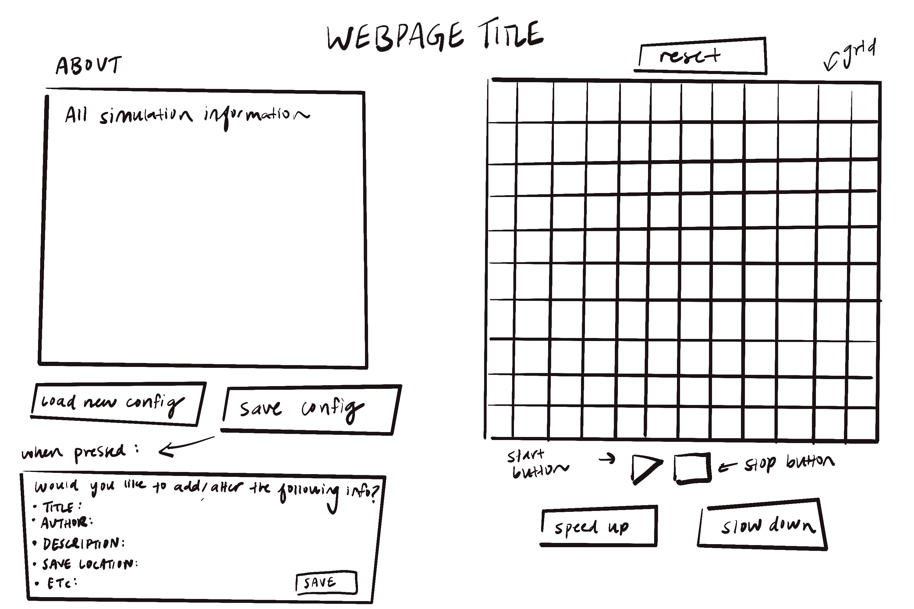
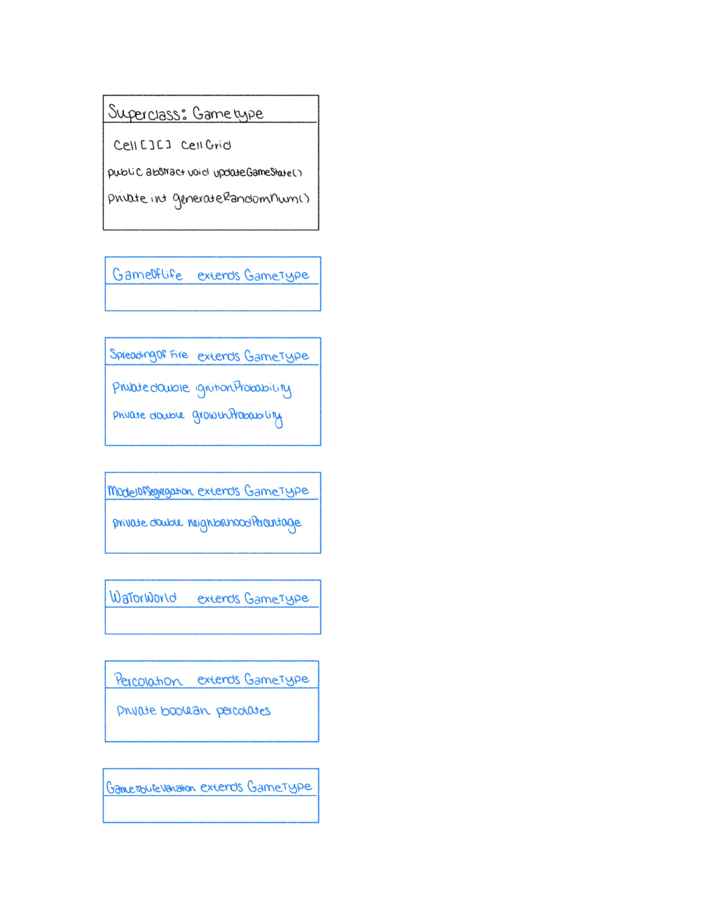
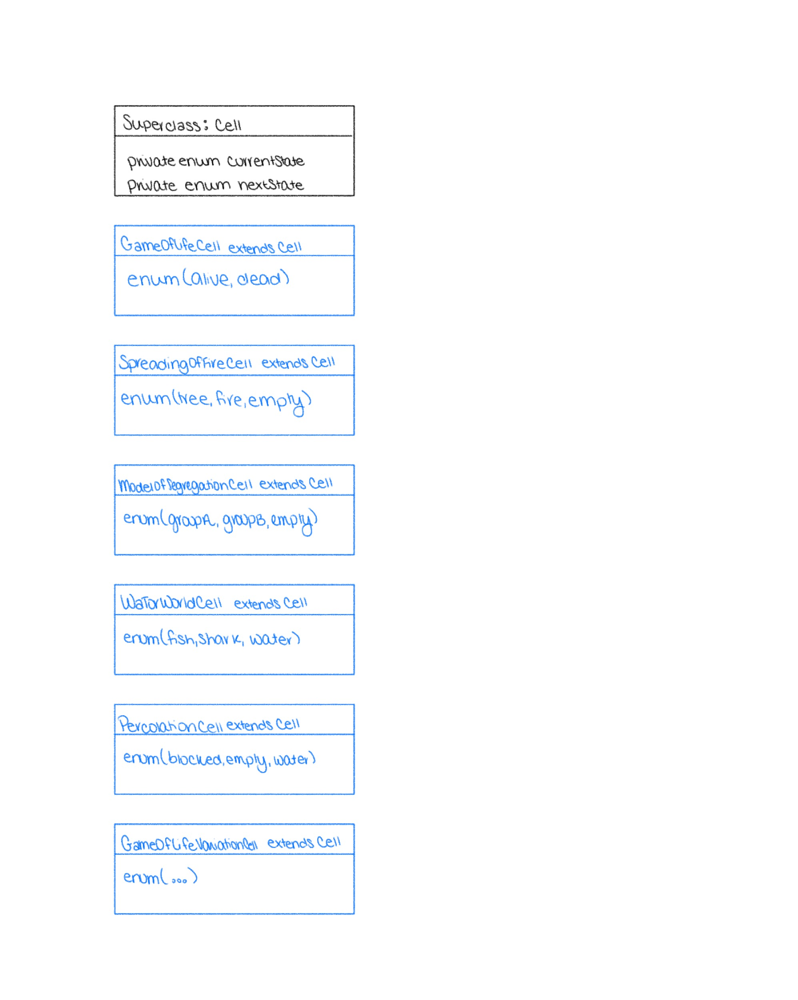
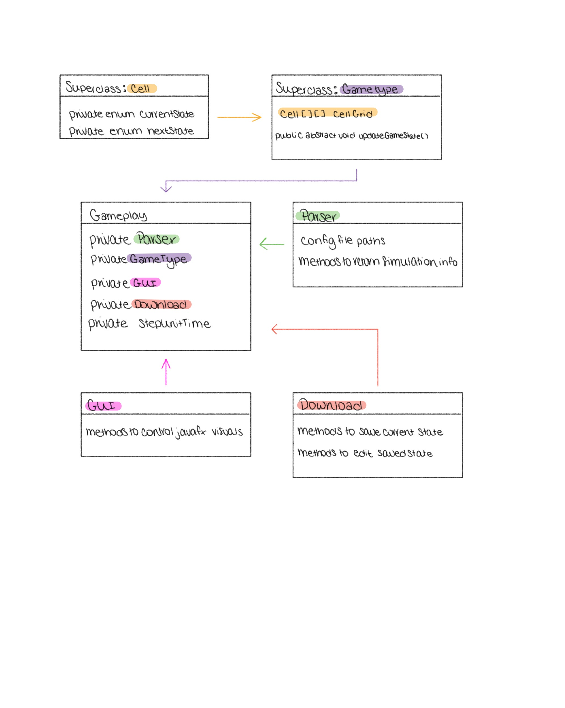

# Cell Society Design Plan
### Team Number: 6
### Names: Jordan, Nikita, Yasha

## Overview
This program should allow users to view different cellular automata simulations through a single platform. We aim to create an intuitive user interface, where users can choose which simulation model they would like to explore, engage with features such as learning about the simulation’s features, authors, etc. The simulation can also change speed, be paused, and downloaded.

The primary design goals of the project involve flexibility in extending the number and type of simulations represented by the program. The program should also facilitate essential functionalities such as playing, pausing, speeding, and downloading simulations.

The primary architecture includes components of both closed and open architecture. The simulation modules: GameType and Cells have open architecture allowing for the seamless integration of additional simulation types. The core functionalities, the UI, and the representation of cells will follow a closed architecture to ensure stability and consistency.

Each simulation type and its corresponding cells will be subclasses that inherit the features of Cell and GameType classes. This will allow additional subclasses to be made in order to extend the program.

## User Interface
Here is a diagram of our user interface:

## Configuration File Format
You can find our 2 example XML files for our configurations in the /config_files folder. The first represents a sample
config file for the Game of Life, and the second represents a config file for the spreading of fire.

## Design Overview
Our program will consist of six main classes that encapsulate the entire functionality of the game.  The Cell class is a
super class that will represent the individual units on the grid.  It will hold information on the current state and next
state of the cell to support accurate synchronous updates.  This class will be extended to create cells for each game variation.

Cells will become the building blocks for the cell grid.  This grid is a 2D array that is a core attribute of the GameType
class.  Similar to the Cell class, the GameType class is a superclass that will be extended to support different game variations.
A key functionality of this class will be updating the grid.

A Parser class will be created to parse information from the XML configuration files.  This class will have constant variables
to hold the file paths and methods to return information about the simulation.  Some of this information will be passed to 
the GameType class to aid in creating the grid.

We will also be creating a Download class.  This class will be responsible for converting the current simulation state to
an XML file for the user to save.  This class will also offer functionality for editing the information included in the XML file.

A GUI class will work with javafx to create our user interface.  This class will create the visual representation of the grid and menus.

Lastly, we will create a GamePlay class to control the time steps and interactions between the above mentioned objects.
For example, when the user presses a designated “screenshot” key, the Download class will be prompted to create an XML file 
from the current state of the GameType cell grid.  Alternatively, the GUI class will update the grid visuals based on the 
current state of the GameType cell grid.

  
  

## Design Details
The two main abstractions in our simulation are the GameTypes and Cell types.  Both of these abstractions will have a subclass for each game type.

The original Game of Life and the Game of Life variation will implement the updateGameState() method by checking each cell’s
neighbors and comparing them to the given criteria.  The Cell subclasses for these simulations will have enums to represent the state.
In the case of the original Game of Life, there are two states (alive and dead).

The Spreading of Fire GameType subclass will have two instance variables to represent the probabilities of tree ignition and growth.
The updateGameState() method will be implemented by first checking each cell’s current state.  Based on this state, the method will either
check the state of the cell’s neighbors or use a random number generator to determine if ignition or growth takes place.
The Cell subclass for this simulation will have an enum to represent the states of empty, tree, and fire.

The Model of Segregation subclass will have an instance variable that represents the percentage of the neighborhood cells
desire to be occupied by their own species.  The updateGameState() method will check occupied cells’ neighbors to determine
if the occupation threshold is met.  If it is not met, the cell will be relocated to the first available appropriate location.
The Model of Segregation Cell subclass will have an enum to represent the states of groupA, groupB, empty.

The Wa-Tor World GameType subclass will implement the updateGameState() method by examining the states of cells neighboring
sharks and fish.  A random number generator characteristic to this class will be used to determine movement for the two species.
The WaTor World Cell subclass will have an enum to represent the states of fish, shark, and empty water.  It will also have
a mechanism for tracking lives.

The Percolation subclass will implement the updateGameState() method by first identifying a start point for water flow.
In subsequent time steps, the method will evaluate neighboring cells to determine which are empty for the water to occupy.
The Percolation Cell subclass will have an enum to represent the states of water, empty, and blocked.

The updateGameSate() method of the GameType class could have multiple implementations that support different data structures modeling 
the grid.  For example, a 2D array of cells could be traversed and manipulated to change the current state of the cells.  
Additionally, this method could iterate through a linked list of nodes that hold a cell as their value.

By this same logic, the methods in the GUI class that control the visual representation of the cell grid can be implemented in 
a various ways.  They could traverse a 2D array of cells or a linked list to update the graphical interface.

## Use Cases

### Given Use Cases:
* Apply the rules to a middle cell: set the next state of a cell to dead by counting its number of neighbors using the Game of Life rules for a cell in the middle
    * <code> GameOfLifeCell cell = new GameOfLifeCell(int state, int x, int y);  
      GameOfLife game = new GameOfLife(GameOfLifeCell[][] grid); 
      //do some stuff here  
      String position = cell.checkBounds(); //middle, edge, corner  
      int amount = game.countNeighborsOf(cell, position); //the count Neighbors method checks if the cell is an edge, corner, or middle  
      cell.updateState(amount); </code>

* Apply the rules to an edge cell: set the next state of a cell to live by counting its number of neighbors using the Game of Life rules for a cell on the edge: same as above

* Move to the next generation: update all cells in a simulation from their current state to their next state and display the result graphically
  * <code> //double for loop to iterate through grid
    GameofLifeCell cell = GameOfLifeGrid[row][col];  
    String position = cell.checkBounds();  
    int amount = game.countNeighbors(cell, position)  
    cell.updateState(amount);  
    //double for loop to iterate through grid  
    cell.currentState = cell.NextState  
    cell.NextState = null; //we’re in the new gen  
    GUI interface  
    interface.updateGrid(grid); </code>

  
  * Switch simulations: load a new simulation from a data file, replacing the current running simulation with the newly loaded one
    * <code> //in GUI class  
    handleLoadButtonPress(XML file);  
    in this method, call the Parser class
    Parser parser = new Parser();  
    Cell[][] grid = Parser.getGrid(file);  
    String title, descr = Parser.getTitle(file), Parser.getDesc(file);  
    this.pause();  
    this.setNewSimulation(title, descr, grid); // set up the UI with the new info </code>

* Set a simulation parameter: set the value of a parameter, probCatch, for a simulation, Fire, based on the value given in a data file
    * <code> //in gamePlay class  
      String type = parser.getGameType(XMLfile);  
      GameType currentGame = this.getClassFromTitle(type);  
      SpreadingOfFire -> 
      parser.getParamValues(this.getClassFromTitle(type));  
      //in the getParamValues method, the parser checks the input class type and individually sets the parameters in a hashmap  
      //inside the method, sets the class’s parameters:  
      if (game.isInstanceOf(SpreadingOfFire)) {game.setProbCatch(parser.getProbCatch()); </code>

  
### Custom Use Cases:
* When a user presses the save button, display the current information and ask if the user wants to edit any information before downloading
    * <code>
      //in GUI class 
      onClick -> this.handleSaveButtonPress(); 
        //ask for scanned in user information, collect all changed/unchanged values in according variables and update all game information 
        File xmlFile = parser.populateGameInformation(currentGame, title, desc, params, etc); //returns an XML file with the updated information about the game 
        return xmlFile;</code>
* When a user presses the reset button, the grid cells go back to their original configurations.
    * <code> //in Gameplay class 
  //each initialized gameplay keeps a record (probably as a Cell[][] 2D array) of the original configurations set by the config file 
  currentGame.reset(); 
  //in this method 
  for each cell in currentGame.grid: 
  grid[row][col].resetStateTo(originalGrid[row][col]);</code>
* User presses button to speed up simulation
  * <code> //in GamePlay class 
    onClick -> this.handleSpeedUpButtonPress(); 
    //inside handleSpeedUpButtonPress() 
    this.timeStep += INCREMENT_TIME_AMOUNT;</code>
* The next state of a cell is dependent on a probability
  * <code> //in GameType subclass 
    //this method generates a double from 0 to 1 randomly and uniformly 
    double rand = generateRandomNum(); 
    if (rand < probability) { 
    //set Cell next state 
    } else { 
    // set Cell next state } </code>
  * When the user presses the “about” button, the game descriptive characteristics are shown
  
    * <code> //In GamePlay class  
    List descriptions = parser.getDescriptions(XMLfile) //returns list of all the needed fields  
    for (int i=0; i<descriptions.length; i++){  
    Text about = new Text(descriptions[i]);  
    aboutScene.getChildren.add(about);} </code>

* Check the neighbors of a Schelling’s Model cell and segregate it since it doesn’t not have enough like cells

    * <code> // in GameType subclass
    Schelling Cell cell= SchellingGrid[position];
    int amount = game.countNeighbors(cell, position) // counts total populated cells
    int same_num = game.countSpecificNeighbors(cell.currentState) //counts total cells with same state
    if same_num < prop {
    empty_position = SchellingGrid.findEmpty() //returns the first found empty position
    SchellingGrid[empty_position].setState = cell.currentState
    Schelling_Grid[position].setState = null;} </code>

## Design Considerations
* Checking for Neighbors:

Different game types have to check for neighbors in different directions (some check 8 cells surrounding a specific cell while others check 4). Furthermore, some gametypes want to return an integer for how many neighbors are present while others also need to check for where the neighbors are. We considered different design implementations for dealing with neighbors. One option would be to define a single method which would be called to check how many neighbors are there if any (including if statements for gameTypes to tell the program where to check). This method could then call other methods to check where these neighbors are located if needed. Another option would be to implement entirely separate neighbor checks for each gameType, checking both the number and location in the game specific subclass’s checkNeighbor method. The advantage to option 1 would allow for minimized duplicated code. However, option 2 would allow more flexibility in implementing other future simulations in case they needed different outputs (beyond merely the location or number of neighbors).

* Storing Shark/Fish Lives in Wa-Tor

Shark and Fish energy needs to be updated to a different value in each cycle of the Wa-Tor game. The program needs to keep track of how much energy has been lost, whether the shark’s energy has increased, or if the energy needs to be reset. Our team discussed in-depth how this value would be stored. The first option we considered was to store it alongside the status of the cell (fish/shark, energy). The energy would then be updated in the same manner as the status, by calling an appropriate checking method. However, we struggled to understand how we would update this integer value when a shark or fish moved cells on the grid. Their energy value would have to move with them to a different cell rather than simply being updated in the current cell, the way the cell status is. Another option was to create Shark and Fish objects that are present in each cell. When the animal moves, the object is passed to the new cell. However, there were limiting factors to this approach as well. How would we define empty cells? If all other games store cell status as a parameter rather than creating a cell status object, a different implementation for one game would make it difficult to extend general GameType methods to Wa-Tor. This design problem is yet to be resolved.

## Team Responsibilities
Timeline: Game of Life & Parser fully functional by Wednesday, All simulations by Friday, Tying loose ends & extensions by Monday

* Jordan: Primarily responsible for Cell and GameType classes (and the corresponding subclasses)

* Yasha: Primarily responsible for GUI, Download, and Parser classes

* Nikita: Primarily responsible for GamePlay; Secondarily responsible for GameType subclasses and creating XML files
